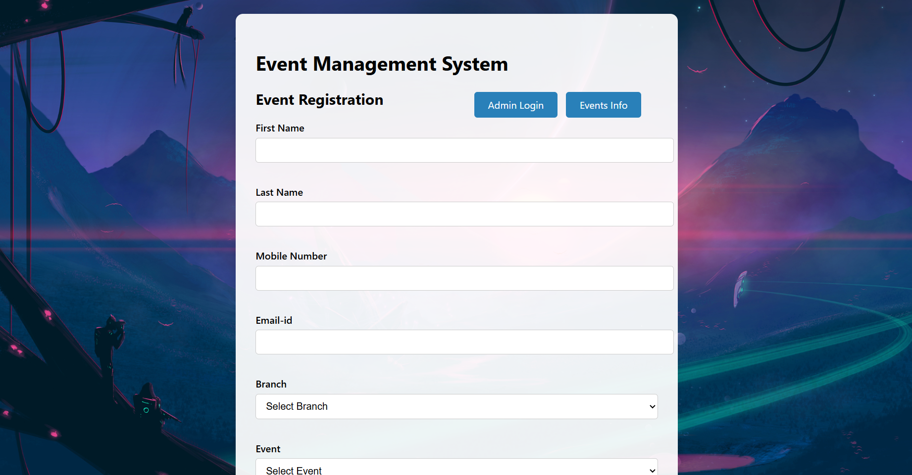
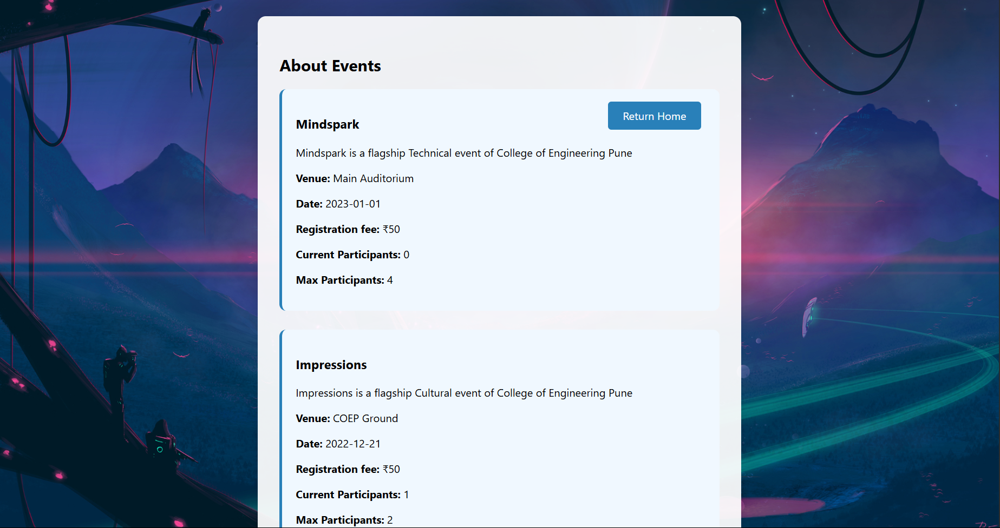
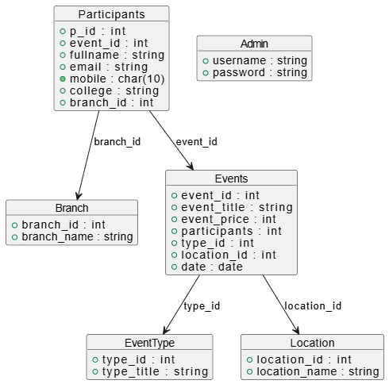

#  Event Management System

A full-featured **Flask + MySQL** web application that allows students to register for events, while admins can create, manage, and view events and participants.

---

##  Features

###  Student:
- Register for events with form validation
- View event types and available slots

###  Admin:
- Login to access dashboard
- Create/delete events
- Track participant count per event
- View participants by event

---

##  Tech Stack

| Layer     | Technology        |
|-----------|-------------------|
| Frontend  | HTML, CSS (Jinja2)|
| Backend   | Python (Flask)    |
| Database  | MySQL             |
---

## Class Diagram

